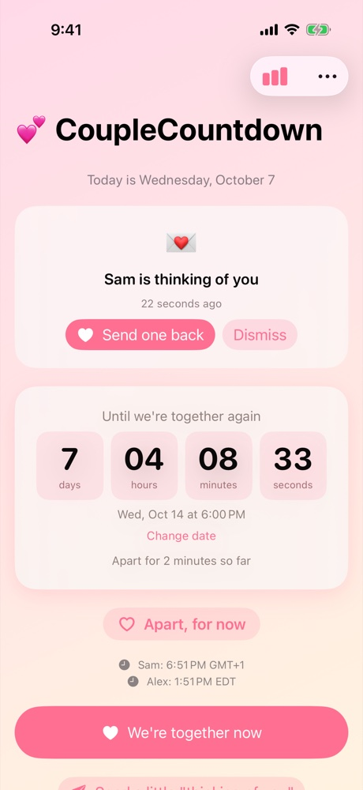
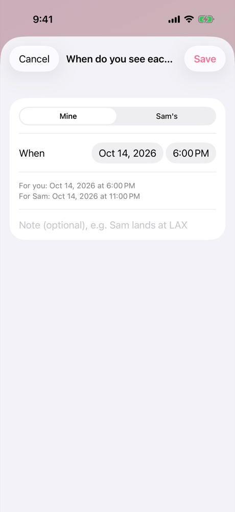
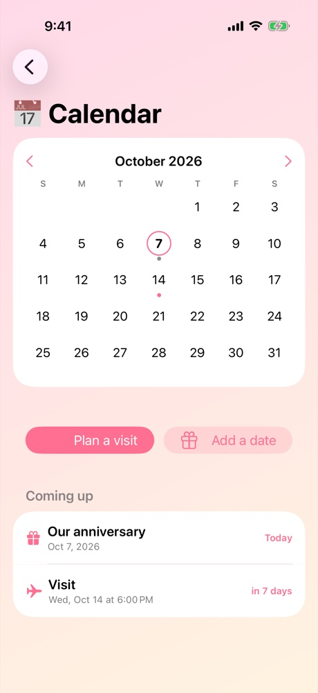
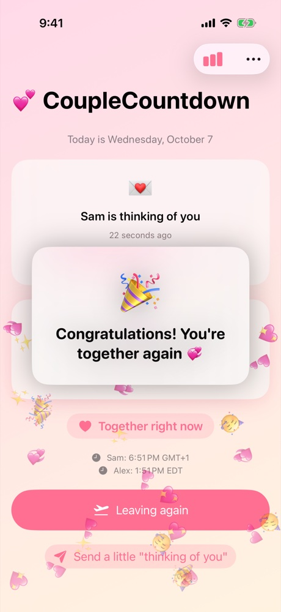
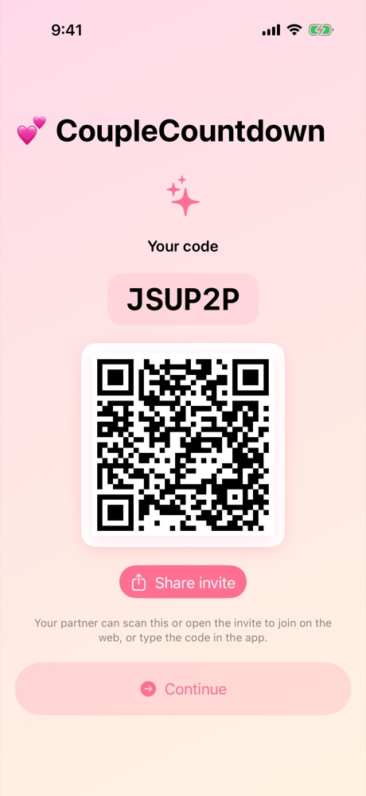
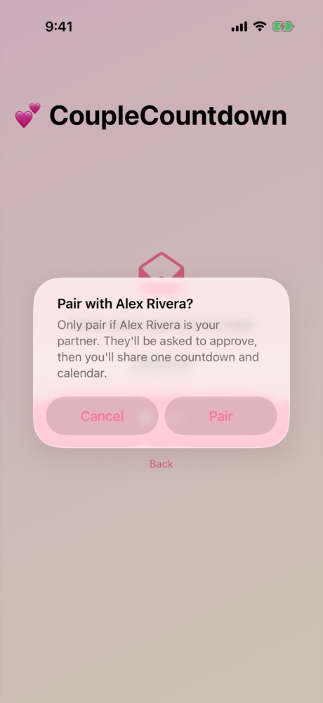
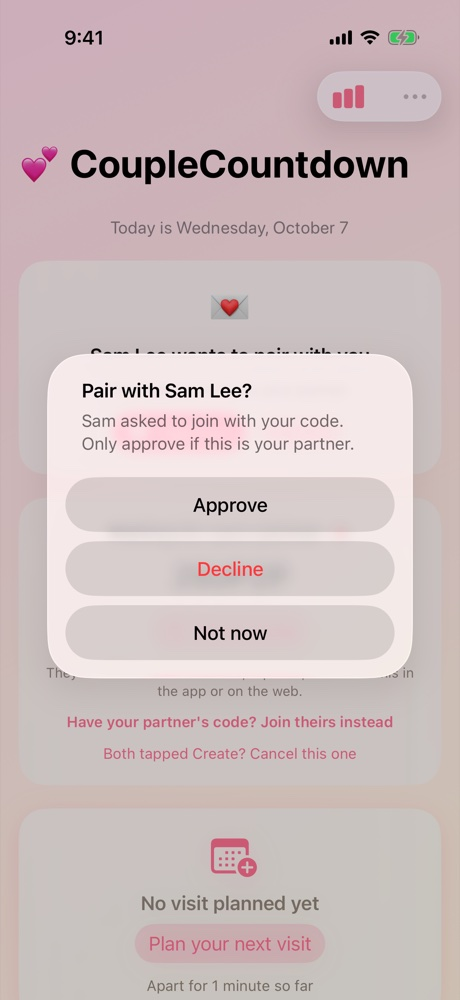
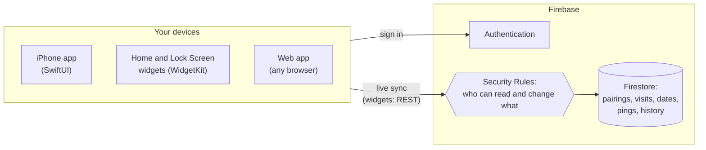

# 💕 CoupleCountdown

**A shared countdown for long-distance couples, to the minute you see each other again.**


**[Open the web app](https://couplecountdown-7715c.web.app)** ·
**[Install on iPhone](#on-iphone)** ·
**[Design doc](DESIGN.md)**

<table>
  <tr>
    <td align="center"><br><sub>The countdown</sub></td>
    <td align="center"><br><sub>Planning across time zones</sub></td>
    <td align="center"><br><sub>Shared calendar</sub></td>
    <td align="center"><br><sub>Together again</sub></td>
  </tr>
  <tr>
    <td align="center"><br><sub>Create a pairing</sub></td>
    <td align="center"><br><sub>Partner confirms</sub></td>
    <td align="center"><br><sub>Creator approves</sub></td>
  </tr>
</table>

Two partners pair their accounts, plan their visits, and watch the same
countdown tick on their phones, their computers, and their iPhone Home and
Lock Screens. When it reaches zero, the app asks whether they've met up, and
only then celebrates. Along the way it keeps track of how long they've been
apart, and lets either of them send a quick "thinking of you".

It's a native SwiftUI iPhone app with widgets, plus a web app for any other
device, both on one Firebase backend.

## Features

**Count down together**
- A live countdown in days, hours, minutes, and seconds, to the minute you
  meet rather than just the day.
- Home Screen and Lock Screen widgets with the days and a live timer.
- When it runs out: **"Have you met up?"** The congratulations come only
  after one of you says yes, on both partners' screens. "Not yet" lets you
  move the time.

**Pair safely**
- Sign up once with your name, email, and password, then use that account on
  any number of devices.
- One of you creates a code, QR code, or invite link. Your partner sees
  **"Pair with Alex Rivera?"**, and you see **"Pair with Sam Lee?"** and
  approve it. Nobody joins without both of you agreeing.
- Codes don't expire. They work until your partner joins or you cancel.

**Plan together**
- A shared calendar of visits (with times and notes) and important dates like
  anniversaries, on a month grid.
- Enter a visit in your partner's time zone when that's easier, and see
  each other's local time at a glance.
- An anniversary is the same day for both of you, whatever your time zones.
- The countdown always follows the next planned visit, so "Leaving again"
  switches straight to it.

**Stay close**
- **"Thinking of you":** one tap, and it shows on your partner's countdown
  and widget until they dismiss it.
- **Time apart, tracked:** "Apart for 23 days so far", how long you were
  apart in each reunion's congratulations, and stats for the current, last,
  and longest stretches apart, reunions, and total days together.
- Milestone celebrations for round numbers of days together (iPhone), and
  three themes with light and dark modes.

## How it's built



### Engineering decisions

- **Firebase, with no server of our own.** The iPhone app, the widget, and
  the web app all talk directly to Firestore and Firebase Authentication, so
  one account and one set of data work everywhere.
- **Security Rules are the access-control layer.** Every permission is
  enforced in Firestore Security Rules: a pairing holds exactly two people,
  joining takes a request the creator approves, once paired only the two
  partners can read or change their data, accounts are owner-only, and a cancelled or
  discarded code closes and clears any request waiting on it.
- **Pairing by code plus approval.** Codes never expire. Joining sends a
  request carrying your full name, and each partner confirms the other's
  name before they're paired. If both of you created codes, joining one
  discards the other in the same write.
- **No push notifications.** Updates arrive through a live listener while
  the app is open, a fetch on launch, background refresh, and the widget's
  own refresh.
- **A widget that doesn't need the app running.** It signs in with the
  account's token and fetches over Firestore's REST API by itself, and only
  shows a pairing the signed-in person really belongs to.
- **Changes apply instantly, even offline.** Status changes, visits, and
  dates show on screen at once and sync when the connection returns. A
  change the server rejects is reported, never passed off as saved.
- **Status and history in one write.** Each apart/together change and its
  history entry are saved together, so they can never disagree, and the
  entry is timestamped when it was tapped, so a reunion confirmed offline is
  logged at the right time.
- **Calendar days versus moments.** Important dates are stored as calendar
  days, so an anniversary is the same day for both partners. Visits are
  exact moments, and can be entered in either partner's time zone.
- **Ask before celebrating.** A countdown reaching zero doesn't mark the
  couple as together; one of them confirms it, which keeps the history of
  time apart accurate.
- **Shared logic.** A Swift package (CoupleCountdownKit) holds the models,
  date math, and stats for both the app and the widget, and the web app
  follows the same rules.
- **A web app with no framework or build step.** Plain HTML, CSS, and
  JavaScript modules, served from Firebase Hosting.
- **Built and released from GitHub Actions.** XcodeGen generates the Xcode
  project, and every push to `main` builds the app and publishes an
  installable `.ipa` with a SideStore source, so it installs without the App
  Store.

The full reasoning, data model, and sync strategy are in
[`DESIGN.md`](DESIGN.md).

## Use it

### On the web

Open **<https://couplecountdown-7715c.web.app>** on any phone, tablet, or
computer. On a phone, use Share → *Add to Home Screen* for an app icon. The
web app has everything except widgets and milestone celebrations, and syncs
with the iPhone app.

### On iPhone

No App Store needed: install it with [SideStore](https://sidestore.io),
which signs apps with your own Apple ID.

1. Set up SideStore by following [its install guide](https://docs.sidestore.io).
2. In SideStore, open **Sources**, tap **+**, and add:
   `https://github.com/Phillyfanbert/CoupleCountdown/releases/download/latest/source.json`
3. Install **CoupleCountdown** from that source. SideStore offers each new
   build as an update.
4. Add the widget: long-press the Home Screen, tap **+**, and choose
   **CoupleCountdown**.

You can also download
[`CoupleCountdown.ipa`](https://github.com/Phillyfanbert/CoupleCountdown/releases/download/latest/CoupleCountdown.ipa)
directly and open it with SideStore. Both links always point at the latest
build. Apps signed with a free Apple ID need refreshing every 7 days, which
SideStore does on the phone.

### Pairing

1. One of you taps **Create a pairing** and shares the code, QR code, or
   invite link.
2. The link opens the web app with the code filled in. Your partner signs up,
   or signs in if they already have an account.
3. They see **"Pair with Alex Rivera?"** and confirm, which sends a request.
4. You see **"Pair with Sam Lee?"** and approve or decline.

If you both tapped Create, either of you can tap **Join theirs instead**,
which discards your own unused code. A pairing is always exactly two people,
each on as many devices as they like.

## Known gaps

- **Real-device install** hasn't been confirmed on a physical iPhone yet.
  The widget's data sharing under free Apple ID signing has only been run in
  the Simulator.
- **No push notifications.** A partner's change or a "thinking of you" shows
  up when the other person next opens the app or their widget refreshes.
- **Themes are per device**, not shared between partners.
- **On the web**, changes made offline sync once the connection returns, but
  only if the tab is still open then. The iPhone app keeps them through a
  restart.

## Tech stack

| Part | Built with |
| --- | --- |
| **iPhone** | SwiftUI, WidgetKit (Home Screen and Lock Screen), a shared Swift package, XcodeGen |
| **Web** | Plain HTML, CSS, and JavaScript modules: no framework and no build step |
| **Backend** | Firebase Authentication, Firestore, and Firebase Hosting |
| **Security** | Hand-written Firestore Security Rules |
| **Build and release** | GitHub Actions: an unsigned `.ipa` plus a SideStore source on every push |

## Project layout

```
CoupleCountdown/          iPhone app (SwiftUI): onboarding, countdown, calendar, stats, settings
CoupleCountdownWidget/    Home Screen and Lock Screen widgets
CoupleCountdownKit/       Swift package shared by the app and widget: models, date math, caching
CoupleCountdownUITests/   iPhone UI tests
web/                      The web app
firebase/                 Firestore Security Rules
docs/screenshots/         The screenshots above
.github/workflows/        Build, release, and screenshot workflows
DESIGN.md                 Architecture, data model, sync strategy, and the reasoning behind each decision
```

## License

All rights reserved. This repository is public for portfolio and viewing
purposes only. No permission is granted to use, copy, modify, or distribute
this code or any part of this project. See [`LICENSE`](LICENSE).

## Author

**Philbert Fan**
